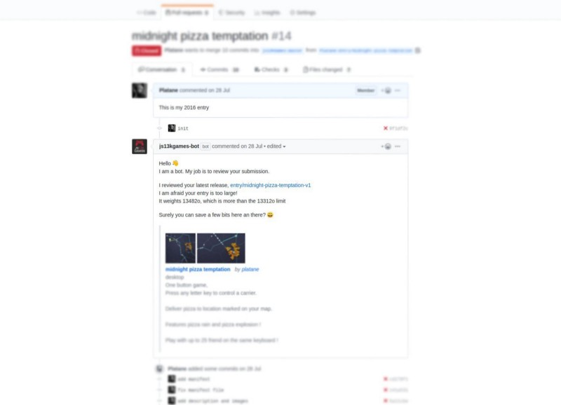
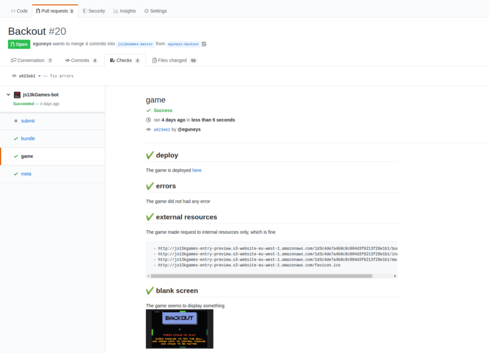

Hello [js13kGames](//js13kgames.com) participants! For those who already submitted a game in the past, you know that the requirements are straightforward:

* make a game under 13k zipped  
* submit the zip file  
* submit two screenshots

It’s simple, yet mistakes are made and every year a fair amount of submissions need some manual fixes. Our wonderful host [End3r](//end3r.com) is doing his best to fix the submissions manually and reject as few as possible, but it’s a lot of work.

In addition, most participants [submit](//js13kgames.com/submit) their game at the very end just before the deadline, and the [queue](//js13kgames.com/queue) grows fast. When the submission does not fully respect the [rules](//js13kgames.com/#rules), little can be done but reject it or painfully find a solution in private with the participant.

Dozens of such cases happen every single year, and it takes hours to fix all of them which slows the acceptance rate of the correct entries submitted through the form.

Considering those issues, I’ve created a [GitHub bot](//github.com/js13kGames/bot#readme) and in 2019 we’re introducing a brand new submission process! This year, submitting your game is as simple as opening a Pull Request! 🎉

New features include:

* automate boring process  
* review early, gives you more time to fix  
* offer a better communication channel

A bot will review all the basic aspects of your submission (image ratio, zip size limit, index.html in the main folder, using external resources, obvious game crashes, etc.) and help you to fix the issues.

## Process

* fork the submission repository: [github.com/js13kGames/entry](//github.com/js13kGames/entry)
* commit your sources, images, and update [manifest.json](//github.com/js13kGames/entry/blob/master/manifest.json)
* publish a new release, with your zip file as asset (the zip file does not need to be part of your committed files)
* send a Pull Request
* after all checks are green, you can submit your entry

The bot will review your submission after each commit or release. Additionally, don’t hesitate to ask for help in the PR discussion.

If the bot does not detect any issues, **you will be given a link to the good old submit form pre-filled with your info** (including the zip and the images). This gives you a chance to add private information that you don’t want to publish (such as your email address).

Given that all the basic tests have passed, and that you took the effort to ensure that, **your submission will be fast-tracked** in the [queue](//js13kgames.com/queue) and accepted way quicker than without the bot. Yay!

There is a step-by-step [guide](//github.com/js13kGames/bot/blob/master/doc/how-to-submit.md#how-to-submit) including advanced use cases like when [you already started committing on another git repository](//github.com/js13kGames/bot/blob/master/doc/how-to-submit.md#i-already-made-a-repository-and-i-dont-want-to-lose-my-history).

Please remember that the new process is still in _beta_. We understand that this is new and may require a little bit more work from you — we’d love to get feedback on how to improve it. Help us do better, thanks!