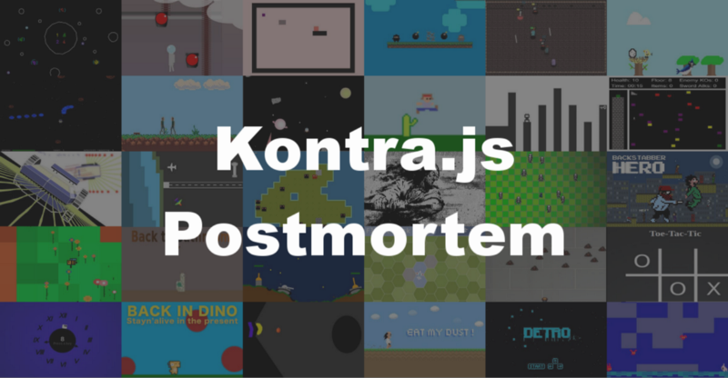

Every year at the end of the js13kGames competition, participants are encouraged to write a _post mortem_ about their experience making a small game in one month. This year I too was encouraged to write a _post mortem_. But not about making a game, but about [Kontra.js](//straker.github.io/kontra/) and my experience writing and maintaining a js13kGames game library.

## Where it all began

Back in 2015, after a few years of learning how to create JS games, I decided I was tired of copying the same code into every new game. The year before I had entered [my first game for js13kGames](//js13kgames.com/entries/terraform) and noticed that there weren’t any game libraries that would fit in such a small file size limit. So I had an idea; why not put all the code I keeping copying into a single library and make it small enough to use in js13kGames.

And thus, [Kontra.js was born](//github.com/straker/kontra/tree/beebe66965af1a18448a0a8815b5b6e1113ea783).

## Maintaining a tiny game library

For the first few years after it was created, the library was mostly just a pet project that I used in my own games and wasn’t really used by anyone else. To help me keep working on it, I decided that every year before js13kGames started, I would try to work on the library and improve it in some way. As a result, I was able to [reduce the file size](//github.com/straker/kontra/releases/tag/3.0.0) almost [every year](//github.com/straker/kontra/releases/tag/v4.0.0). Some years, that was the only thing I was able to do to the library.

Starting in 2018 (three years after it was created) the library began to really be used by others. The year before saw [the first game made with Kontra.js](//js13kgames.com/entries/a-day-in-the-life) outside of my own games. Combined with an article I wrote earlier that year on [making a game with Kontra.js](//medium.com/web-maker/making-asteroids-with-kontra-js-and-web-maker-95559d39b45f), I think others saw potential in the library and were willing to give it a go.

During the 2018 js13kGames competition, users opened up about 15 issues and 10 PRs, with about half of them coming from a single user! On top of that, I was also [working on my own game](//2019.js13kgames.com/entries/audio-dash) for that year and so had to balance fixing issues and finishing my game. In the end, I resolved the issues but my game wasn’t quite finished.

## In preparation for this years competition

In the months leading up to the competition, I once again worked to reduced the file size of the library by converting it to [use ES6 modules](//github.com/straker/kontra/releases/tag/v6.0.0). This also allowed users to pull in just the parts of the library they needed instead of all of it. It took a few months, but the result was well worth it.

I also continued to work on resolving issues that trickled in from users who were starting to use the library outside of js13kGames, including a game for [Ludum Dare 44](//ldjam.com/events/ludum-dare/44/snek-farm), and its [first use in a commercial game](//jackboxgames.com/trivia-murder-party-two/).

## How this years competition went

This year was an exciting time for **Kontra.js** as it saw the most activity since its inception. For the competition there were:

* 20 opened issues
* 17 opened PRs
* 7 new contributors
* 6 releases
* 30 games made using Kontra.js

The 30 games are:

* [20461 Dioretsa](//js13kgames.com/entries/20461-dioretsa)
* [Troposphere](//js13kgames.com/entries/troposphere)
* [Back To That Platform I Was On Before Jumping](//js13kgames.com/entries/back-to-that-platform-i-was-on-before-jumping)
* [Ninja Take Back](//js13kgames.com/entries/ninja-take-back)
* [Noegnud](//js13kgames.com/entries/noegnud)
* [Back to the Nest](//js13kgames.com/entries/back-to-the-nest)
* [Send the Asteroids Back](//js13kgames.com/entries/send-the-asteroids-back)
* [Start Over](//js13kgames.com/entries/start-over)
* [BackStone](//js13kgames.com/entries/backstone)
* [We Must Go Back!](//js13kgames.com/entries/we-must-go-back)
* [Backside](//js13kgames.com/entries/backside)
* [Back Down The Tower](//js13kgames.com/entries/back-down-the-tower)
* [Lost Robot](//js13kgames.com/entries/lost-robot)
* [Back on Track](//js13kgames.com/entries/back-on-track)
* [Back to the Island](//js13kgames.com/entries/back-to-the-island)
* [Godai is back](//js13kgames.com/entries/godai-is-back)
* [Back to life](//js13kgames.com/entries/back-to-life)
* [Backstabber Hero](//js13kgames.com/entries/backstabber-hero)
* [Grow Back](//js13kgames.com/entries/grow-back)
* [Back to Bathroom](//js13kgames.com/entries/back-to-bathroom)
* [Tanky McTankface](//js13kgames.com/entries/tanky-mctankface)
* [Flight Back Home](//js13kgames.com/entries/flight-back-home)
* [Dodge That Shit](//js13kgames.com/entries/dodge-that-shit)
* [Toe-Tac-Tic](//js13kgames.com/entries/toe-tac-tic)
* [Back & Forth](//js13kgames.com/entries/back-forth)
* [Back in Dino](//js13kgames.com/entries/back-in-dino)
* [Shoot2Live](//js13kgames.com/entries/shoot2live)
* [Eat My Dust!](//js13kgames.com/entries/eat-my-dust)
* [Detro](//js13kgames.com/entries/detro)
* [Meadow](//js13kgames.com/entries/meadow)

A lot of PRs and issues this year were focused on improving the Tile Engine code and making Sprites work better with it. It was exciting to see that part of the library get more use and become more robust. We were also able to add a few new features such as the ability to flip a Sprites image using negative width/height.

I’ve been blow away by the growing community. Even now, after the competition has ended, there’s still activity and users helping to make the library better. They’ve been able to resolve bugs, add multi-touch support, improve performance, support different keyboard layouts, and even started to help with the next version of the library!

Moreover, the community has been actively helping to answer questions from other users and contribute to discussions on PRs and issues! There has been so much activity that I even had to start using Github tags just to help keep things organized.

## Where to go from here

With so much activity this year, I decided to put together a [Twitter poll](//twitter.com/StevenKLambert/status/1172875307767889927) to get input from the community about what would make the library more useful. The result was that the library should be even smaller. There were quite a few entries this year that took the library as a base and then removed everything they didn’t need.

Trying to squeeze every byte of savings out of the library was a common thing I heard. So for next year, I plan to make the library even more modular so you only get exactly what you need. Things like splitting the monolithic Sprite class into smaller pieces, adding a composition layer so you can add optional features like rotation and anchor, and moving collision detection out of the Sprite should all help make it the smallest it can be.

There were also lots of requests to keep expanding the library with new features. Things like adding scene, view, and sprite management, gesture support, and UI components. Thanks to ES6 modules, I can continue to provide new features that can be brought into a game only when needed.

I look forward to see where the library goes for next years competition, and for all the future games that will be made with it. Thank you for letting me be part of your amazing games and for helping to make the library even better.