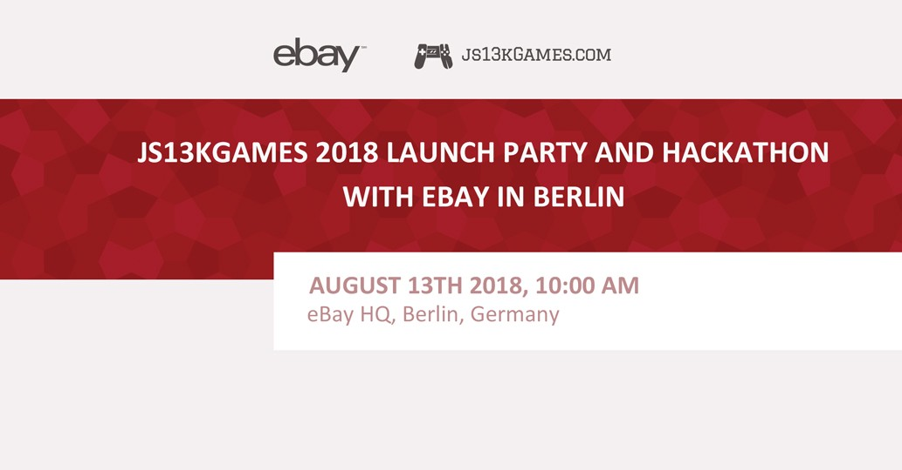

One of the news I wanted to share is the fact that I’ll be flying from Warsaw to Berlin to be in [eBay](//ebay.com)’s 
office on August 13th for a special event - Launch Party and a hackathon.

Last year we did the [js13kGames 2017 Launch Party in Warsaw](//dev.end3r.com/2017/09/js13kgames-2017-launch-party) 
in Codility’s office, and it was a js13k-themed meetup. I gave an intro talk, and then we had a panel with judges and 
participants from previous years.

This year though it will be quite different, and it’s because eBay got excited about the whole idea behind the 
competition. Main reason for that is [Sascha](//twitter.com/sdepold), who participated in js13kGames long time 
ago and now he’s working for eBay (and by the way, they are 
[looking for devs](//jobs.ebayinc.com/job/dreilinden/software-developer-node-js/403/7920567) to join their team).

It will start on Monday, August 13th at 10:00 AM and will last throughout the day till late evening. Instead of a 
meetup, we will have a warm-up hackathon to create a working prototype in just a few hours.

Unfortunately, this event will be **internal**, meaning it’s for eBay staff only, so I won’t be able to invite any 
js13k folks from Berlin. On the other hand I’m still experimenting on what could be organized at the beginning or during 
the competition, and you’re free to do basically whatever you want on your own anyway.

Do you have your regular monthly **meetup** organized locally? Make it js13k-themed! Do you plan to run a **hackathon** 
that accidentally is happening at the same time? Do both and submit your entries to [js13kGames](//js13kgames.com)! 
Whatever you do, please **let me know** - we will be able to let others know, so they can join you!

I know one or two US based companies are considering organizing Launch Party in the form of a meetup in their own 
offices, so I’ll let you know if they’ll go official and open it to others. I also know we have a cool meetup on the 
other side of the world which I hope will prepare something special too.

Only a few days left and I still have a bunch of things to announce, so stay tuned!
