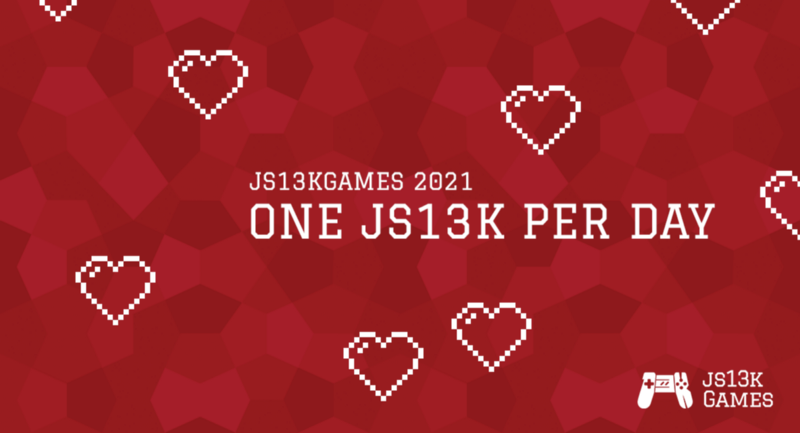

[js13kGames](//js13kgames.com/) is one of my favorite events of the year; as a developer, I cannot wait to exploit all possible technical tricks and figure smart ways to use procedural generation to fit as much content as possible into that little .zip, while at the same time optimizing my design process to remove all bloat into the purest possible game.

Participating in the jam should be a joyful experience in itself, but as indie developers it’s undeniable we look forward to having people play our game, to enjoy (or not) the result of all these hours of frantic late-night coding, maybe get some feedback to improve and definitively some words of encouragement to continue your gamedev journey.

However, as the compo grows, it gets increasingly harder to get more people to play your game. For 2021 we had a total of [223 entries](//js13kgames.com/entries/2021), and despite the efforts by [streamers](//www.youtube.com/watch?v=KBb9yP7FPgs&list=PLYKU1lvSF85fITmDh5Akb_AvQ7mk84SVb) to try to cover as many games as possible, and recent improvements in the voting process so you get at least SOME feedback from peers, you can still be left wanting for more.

Presenting: **One JS13k per day**! We are going to put the [js13kGames Slack](//slack.js13kgames.com/) into proper use while we wait patiently for 2022, by sharing a single game per day so that we as a community can focus on it. Look out for the _#daily-game_ channel in the Slack where, starting next week, we will be sharing the link to a game every day, to get the conversation started. Keep an eye for yours but, most importantly, don’t miss the chance to experience the games created by other fellow coders.

Oh my, we have almost a complete year of fun games ahead, isn’t it exciting?