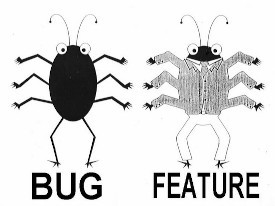
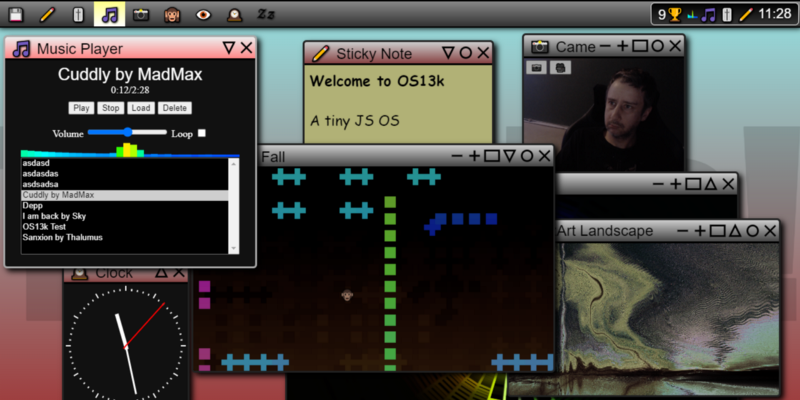
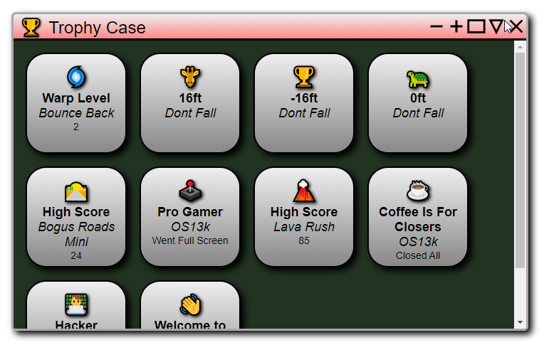
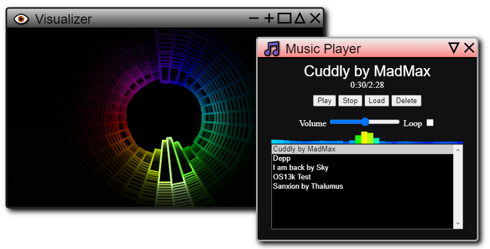
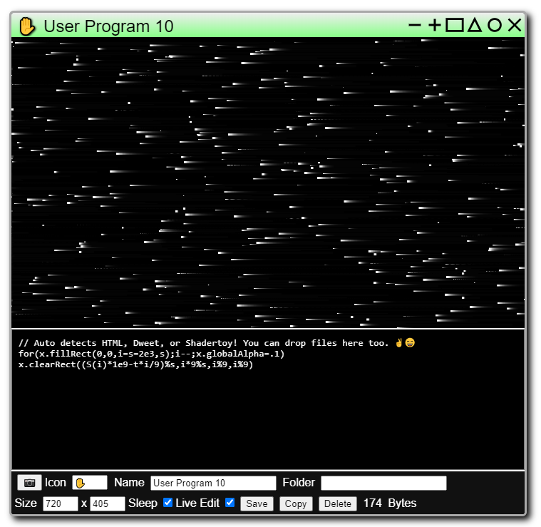

Hello everyone, I am here to share a surprise we’ve cooked up for this years JS13k. As most of you know, all JS13k games share the same local storage, which can be problematic because every game needs a unique prefix to avoid name collisions. We’ve turned that bug into a feature: _a shared trophy and music system that any JS13k game can opt into!_ If that isn’t enough, we’ve created an entire pseudo operating system to tie it all together.

## Welcome to OS13k

Have you’ve heard of fantasy consoles like the Pico-8? Well, the best way to explain the vision behind OS13k is a _fantasy OS and tiny game engine for creative coders_. The OS is simple enough for anyone to use and has some powerful features for advanced users.

* [ZzFX](//killedbyapixel.github.io/ZzFX/) sound effects with support for sound seeds
* [ZzFXM](//keithclark.github.io/ZzFXM/) music system, player, and visualizer
* Trophy system with popups and viewer
* Custom HTML, [Dwitter](//www.dwitter.net/), and [Shadertoy](//www.shadertoy.com/) programs with live editing
* GUI with window manger, taskbar, tray and settings
* Mobile/touch support

We have been hard at work getting this ready for the past few months, and the [full source code is now available on GitHub](//github.com/KilledByAPixel/OS13k)!

One of the coolest features of OS13k is the ability to track trophies and music across all JS13k games and that’s what this post is about, so let’s get to it!

## Trophies

There’s something really fun about building a collection of trophies across many games. It gives players a sense of progress and a reason to return later with only minimal overhead.

The trophy system for OS13k mimics what you would expect to see on a modern game console though simplified. Each trophy has only 4 parts...

* Icon — One or more characters or emojis
* Game Name — Name of your JS13k game
* Trophy Name — Name of the trophy
* Message — Optional message for the trophy

To unlock a trophy in your JS13k game, simply add the following code, replaced with your trophy’s info…

`localStorage\[‘OS13kTrophy,Icon,Game Name,Trophy Name’\] = Message`

When other JS13k games unlock trophies, OS13k will automatically detect new trophies, show a popup, reads the trophy name aloud, and add it to the user’s trophy case! It will also show a popup whenever the message for a trophy changes.

This works by looking for local storage for keys that begin with OS13kTrophy. The rest key is then split at commas to get the trophy parameters. OS13k will even listen for local storage events to detect new trophies while running in the background.

A few more things to be aware of...

* HTML tags and commas can’t be used in trophy strings
* You can track data with trophies for unlocks or high scores
* Don’t abuse the system, lets limit it to 10 trophies per game

## ZzFXM Music

The music system was developed by Keith Clark and myself. It is designed specifically for size limited productions like JS13k games. You can [learn more and hear a demo on GitHub](//keithclark.github.io/ZzFXM/).

Musical instruments are played using [ZzFX](//killedbyapixel.github.io/ZzFX/) sounds. I had originally developed ZzFX as a tiny sound effects tool, and used it for [my 2nd place JS13k game last year.](//frankforce.com/bounce-back-postmortem/) Since then I’ve added even more features, doubled the parameters, and improved the sound designer.

Combining sound effects and music into the same system with songs that zip efficiently, makes it extremely useful for JS13k games. We are working on a native sequencer that should be ready soon, so look out for that.

If you use ZzFXM for music in your game, there is a small optional step needed to register it with the user’s OS13k music library. Simply use the following code, replacing the parameters with your song...

`localStorage\[‘OS13kMusic,Song Name’\] = JSON.stringify(song)`

When the OS13k music player next loads, it will check local storage for any new music, verify if it is valid, and add it to the user’s library! Users can also manually add music by clicking the load button and pasting in the code.

## User programs

Advanced users can extend OS13k by adding custom programs. The system automatically detects if it is HTML, [Dweet](//www.dwitter.net/), or [Shadertoy](//www.shadertoy.com/) code. Everything is saved in local storage for when the user returns and accessible via the menu.

You can live edit user programs to experiment with creative coding, it’s a great sandbox to play around in for beginners or experts! All of OS13k’s features are available to user programs with some extra tools to help with live editing, debugging, and file management.

## JS13k and beyond

The focus right now is on JS13k and this is all very experimental so it will be interesting to see how things turn out. After JS13k we will continue developing OS13k and adding more apps. I already snagged [www.os13k.com](//os13k.com/), it just redirects to the GitHub for now though.

## Join us

I could not have done this alone! There were many people involved, [listed on the GitHub page](//github.com/KilledByAPixel/OS13k/blob/master/README.md#contribuitors). Right now we are focused on making tiny games to fill out [the JS13k build](//killedbyapixel.github.io/OS13k/JS13k/). If you are interested in helping out and joining our group JS13k entry, [join the Discord server](//discord.gg/n8vxUcZ) or [send me a pull request](//github.com/KilledByAPixel/OS13k). Either way we’re looking forward to earning some fun trophies and hearing your music.

Thank you for reading, and good luck on all of your JS13k games! [You can follow me on twitter for more tiny coding adventures.](//twitter.com/KilledByAPixel)