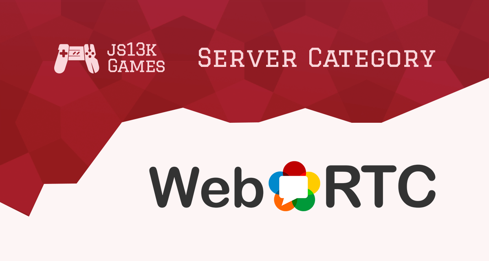

Ok, WebRTC is not a “✨new thing™✨” in 2020, however, it was never possible to make a [WebRTC](//webrtc.org/)\-powered game in the [js13kGames](//js13kgames.com/) competition up until now.

As you may know, js13kGames competition has the [Server category](//github.com/js13kgames/js13kserver) since 2013, and by “server” we mean “⚡🔥multiplayer💥🌶”. However, we could never implement a [STUN](//en.wikipedia.org/wiki/STUN) server (_the basic infrastructure to how WebRTC works_) and a great game inside 13k size limit. And since 2014 we have (a necessary) technical restrictions to the implementation of some server features that make it impossible to add STUN functionality to a simple game.

Well, the only good solution is to flexibilize the [Rule](//js13kgames.com/#rules) #3 (_No external libraries or services_) to allow connection to Google’s STUN servers:

* stun.l.google.com:19302
* stun1.l.google.com:19302
* stun2.l.google.com:19302
* stun3.l.google.com:19302
* stun4.l.google.com:19302

## Why is this interesting and why you should consider this in your next game

WebRTC is a technology to allow P2P connections between web browsers…

_Hey, and why that talk about server implementation?_

Well, in this world where the internet is a huddle of [NAT](//en.wikipedia.org/wiki/Network_address_translation)s, no end-user application can simply start to talk with another end-user application without someone with a public address to intermediate the connection of those peers.

That said, with [WebRTC](//webrtc.org/) you can exchange media streams and data without a server between them, receiving and processing all data.

The first obvious opportunity is to merge users’ voice and video interactions as a piece of the game.

The second opportunity is to find a way to allow many player rooms without exploding the small free Heroku server we are using to host all [Server category](//github.com/js13kgames/js13kserver) games in the js13kGames competition.

Let me explain: in most multiplayer game implementations the game logic runs on the server. If the game is a MMO or it has rooms for a limited number of players in a session, the server will slow down a bit for each player. And that will become a performance problem fast on a free server.

You must use creativity to solve the MMO problem with WebRTC, however, for room based server games, you can simply make the user who had created the room as the game logic processor, just change the place where you would put that code.

## Great! How do I implement WebRTC?

I can give you some nice links providing all you need to know (and some code to copy and paste):

* [Getting Started with WebRTC](//www.html5rocks.com/en/tutorials/webrtc/basics)
* [A simple (local) dataChannel messenger](//developer.mozilla.org/en-US/docs/Web/API/WebRTC_API/Simple_RTCDataChannel_sample)
* [A photo transfer over dataChannel](//github.com/googlecodelabs/webrtc-web/tree/master/step-06)

**⚠ Remember:** the js13kGames competition allows only the public Google’s STUN servers. No others, and no TURN servers allowed.