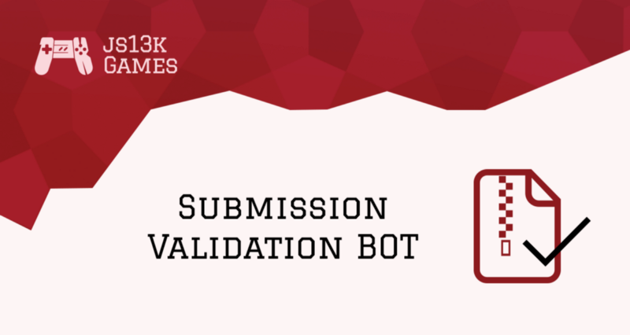
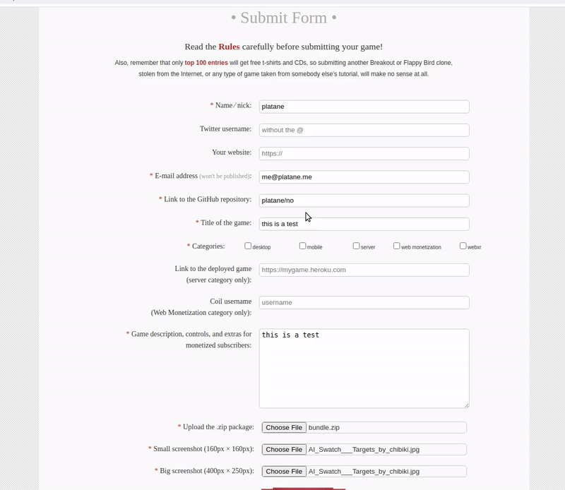

Hello [js13kGames](//js13kgames.com/) participants! We have good news concerning the submission process this year.

## What’s wrong with the current form?

As the number of participants grow, it’s more and more time consuming each year to check manually that the submitted games are valid (ie: don’t break the rules, don’t throw any errors in the console, etc).

Most of the time those are small fixes, but communication between the reviewer and the participant is mostly done by email, which is not perfect to say the least.

## Lessons from previous years

Last year we introduced a whole [new submission flow](/blog/brand-new-validation-bot) through GitHub pull requests. We learned some lessons from the \~100 participants who used it:

* As expected, it did help to eliminate some basic failures at the source.
* The process was very confusing. The PR and release steps created a lot of friction. Especially for devs with less experience, problematically the ones we want to help the most.
* Communication with PR comment was helpful yet marginal.

## Today’s solution

So we ditched the GitHub flow, and went with something easier. We are now providing an endpoint hooked to the submit form you already know, which will run some checks on the zip package you attach to it.

On the file selection, it runs the checks automatically and display either a satisfying list of green checks, or hints on how to solve the given problems.

Notice that you are allowed to submit anyway in case you think the report is wrong. And if you need help with your entry, the [Slack channel](//slack.js13kgames.com/) is full of people willing to help you!

## And more

Thanks to [BrowserStack](//www.browserstack.com/open-source) for supporting Open Source and providing us with a platform to test each submission ❤️

The bot’s source code is [hosted on Github](//github.com/js13kGames/bot#readme). The endpoint is public, feel free to use it as part of your personal build process (although we might migrate to a proper domain at some point in time).

In the future we might offer a Github action that you can plug to your repository. Maybe you can help with that? Or you are thinking of some advanced checks that you want to add? PRs are welcome! :)